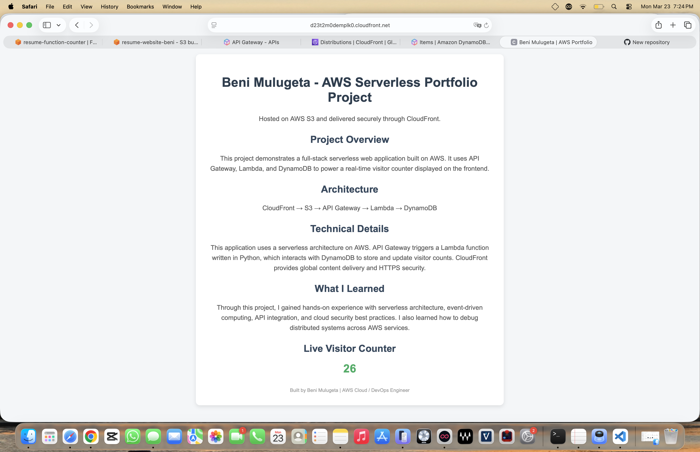
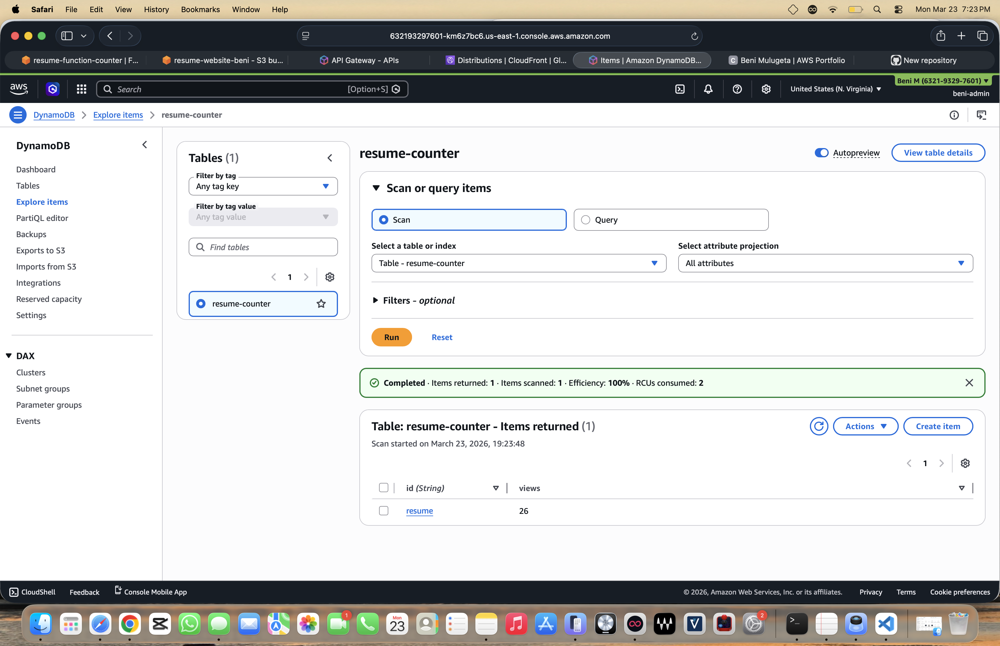
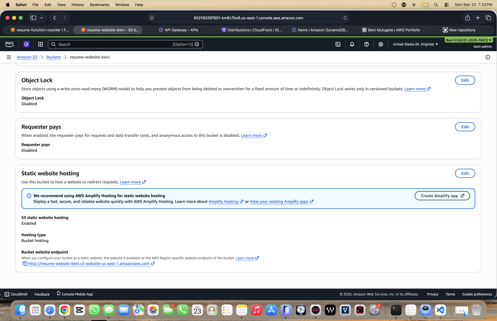
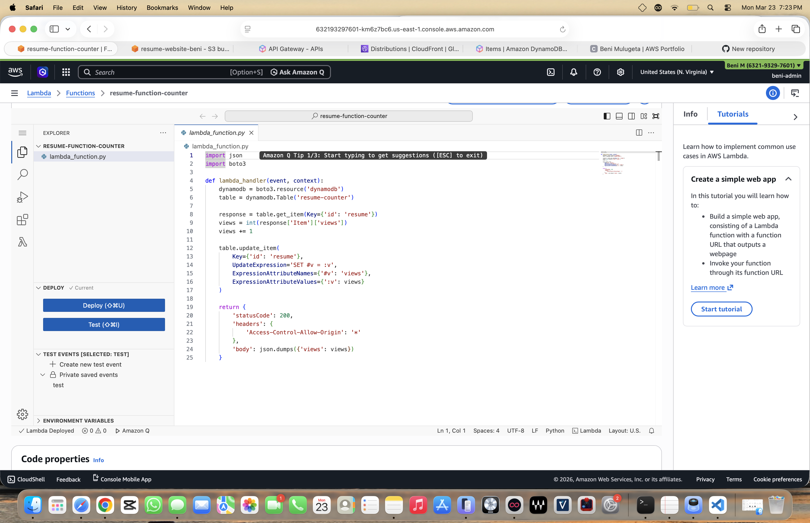
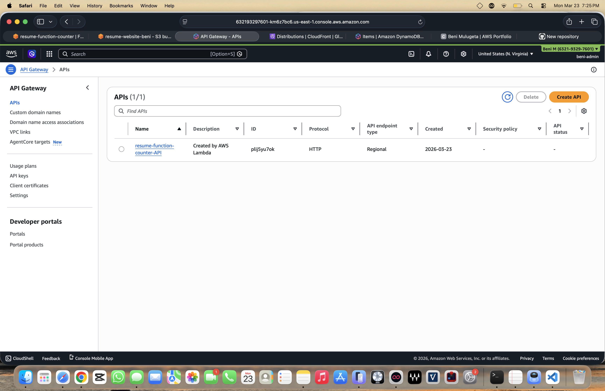
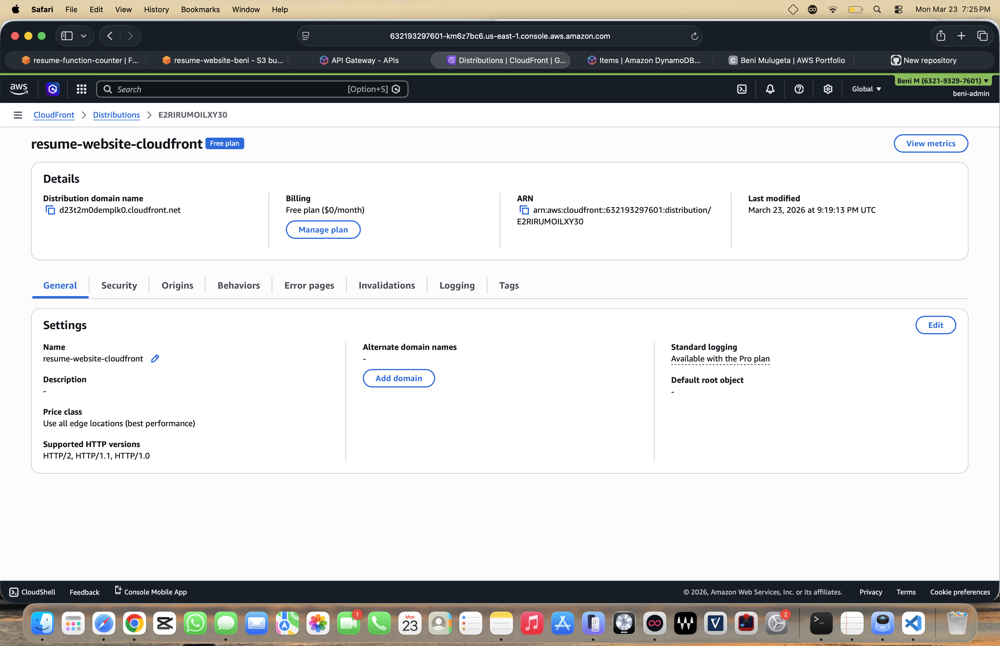

# AWS Serverless Portfolio Project

## 📌 Overview
This project is a full-stack serverless web application built on AWS. It tracks real-time website visitors using a scalable and cost-efficient architecture.

The frontend is hosted on Amazon S3 and delivered globally through CloudFront, while backend services are powered by API Gateway, AWS Lambda, and DynamoDB.

---

## 🚀 Live Demo
🌐 http://d23t2m0demplk0.cloudfront.net

---

## 🏗️ Architecture

### Frontend
- Amazon S3 (Static Website Hosting)
- CloudFront (CDN for global delivery)

### Backend
- API Gateway (REST API)
- AWS Lambda (Serverless compute)
- DynamoDB (NoSQL database)

---

## 🔁 How It Works
1. User visits the website
2. CloudFront delivers the static content
3. A request is sent to API Gateway
4. API Gateway triggers a Lambda function
5. Lambda updates the visitor count in DynamoDB
6. The updated count is returned and displayed

---

## 📸 Screenshots

### 🌐 Live Website

### 🗄️ DynamoDB Table

### ☁️ S3 Bucket

### ⚙️ Lambda Function

### 🔌 API Gateway

### 🌍 CloudFront Distribution

---

## 🧠 Key Skills Demonstrated
- Serverless Architecture
- AWS Cloud Services (S3, CloudFront, Lambda, API Gateway, DynamoDB)
- REST API Integration
- Frontend + Backend Integration
- Cloud Deployment & Debugging

---

## 💡 What I Learned
- How to build and deploy a fully serverless application
- How AWS services integrate in real-world systems
- Troubleshooting CloudFront caching and invalidations
- Managing permissions and IAM roles

---

## 🔧 Future Improvements
- Add authentication (Cognito)
- Improve UI/UX design
- Add CI/CD pipeline for automated deployments
- Custom domain with HTTPS (Route 53 + ACM)

---

## 👤 Author
**Beni Mulugeta**
